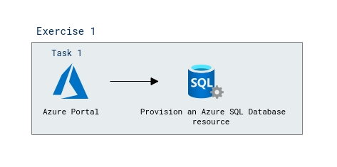

# Lab Scenario Preview: Module 01: Explore Azure SQL Database

## Lab overview

In this lab, you will learn how to provision an Azure SQL Database resource in your Azure subscription, and then use SQL to query the tables in a relational database.

## Objectives

After you complete this lab, you will be able to:

- Provision a database service on Azure

## Architecture Diagram

   
 
Now that you know what the lab is going to be all about, you can launch next item **Hands-on Lab** which includes lab environment and lab guide. You can also preview the full lab guide [here](https://experience.cloudlabs.ai/#/labguidepreview/89fb35f0-1eb5-4fae-a422-fa00d388fef1) if you want to go through detailed guide prior to launching lab environment.  

