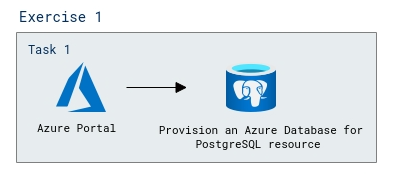

# Lab Scenario Preview: Module 1A: Explore Azure Database for PostgreSQL

## Lab overview

In this exercise, you'll learn how to provision an Azure Database for PostgreSQL resources in your Azure subscription.

## Objectives

After you complete this lab, you will be able to:

- Create Azure Database for PostgreSQL Flexible Server. 

## Architecture Diagram

  

Once you understand the lab's content, you can start the Hands-on Lab by clicking the **Launch** button located in the top right corner. This will lead you to the lab environment and guide. You can also preview the full lab guide [here](https://experience.cloudlabs.ai/#/labguidepreview/57bc72ec-898e-41a4-96ae-0ba235ebe6ad) if you want to go through detailed guide prior to launching lab environment. 
