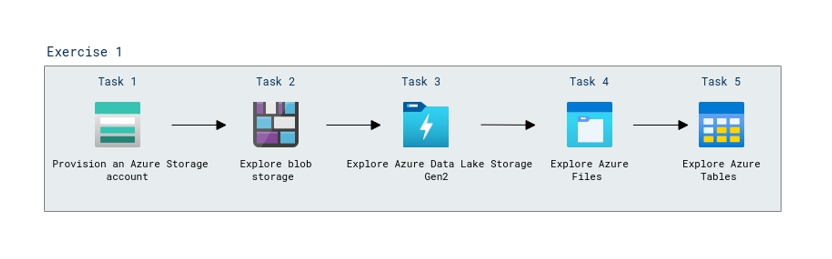

# Lab Scenario Preview: Module 02: Explore Azure Storage

## Lab overview

In this lab, you'll learn how to provision an Azure Storage account in your Azure subscription, and explore the various ways you can use it to store data.

## Objectives

After you complete this lab, you will be able to:

- Create Azure Storage
- Create blob storage
- Upload files to Azure Data Lake Storage Gen2
- Create Azure Files
- Create Azure Tables

## Architecture Diagram

  

Now that you know what the lab is going to be all about, you can launch next item **Hands-on Lab** which includes lab environment and lab guide. You can also preview the full lab guide [here](https://experience.cloudlabs.ai/#/labguidepreview/8d42ea5c-5ad6-43c6-8f3a-fae30ee4053c) if you want to go through detailed guide prior to launching lab environment. 

