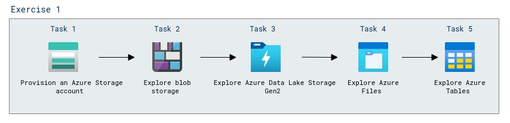

# Lab Scenario Preview: Lab 02: Explore Azure Storage

## Lab overview

In this lab, you'll learn how to provision an Azure Storage account in your Azure subscription, and explore the various ways you can use it to store data.

## Objectives

After you complete this lab, you will be able to:

- Create Azure Storage account and blob storage.
- Upload files to Azure Data Lake Storage Gen2.
- Create Azure Files and Azure Tables.

## Architecture Diagram

  

Once you understand the lab's content, you can start the Hands-on Lab by clicking the **Launch** button located in the top right corner. This will lead you to the lab environment and guide. You can also preview the full lab guide [here](https://experience.cloudlabs.ai/#/labguidepreview/8d42ea5c-5ad6-43c6-8f3a-fae30ee4053c) if you want to go through detailed guide prior to launching lab environment.
