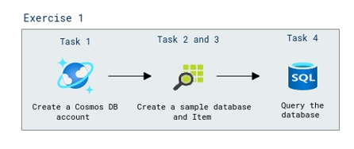

# Lab Scenario Preview: Lab 03: Explore Azure Cosmos DB

## Lab overview

In this lab, you'll learn how to provision an Azure Cosmos DB database in your Azure subscription, and explore the various ways you can use it to store non-relational data.

## Objectives

After you complete this lab, you will be able to:

- Create a Cosmos DB account
- Create a sample database
- View and create items
- Query the database
  
## Architecture Diagram

Once you understand the lab's content, you can start the Hands-on Lab by clicking the **Launch** button located in the top right corner. This will lead you to the lab environment and guide. You can also preview the full lab guide [here](https://experience.cloudlabs.ai/#/labguidepreview/9c915f5c-ea54-4962-9f61-b43e5ca53a65) if you want to go through detailed guide prior to launching lab environment.
