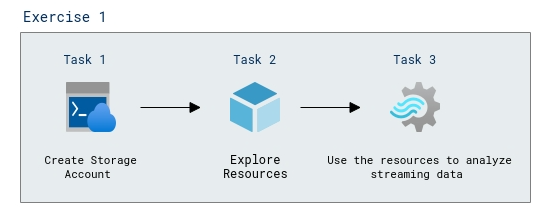

# Lab Scenario Preview: Module 05: Explore Azure Stream Analytics

## Lab overview

In this lab, you'll learn how to provision an Azure Stream Analytics job in your Azure subscription, and use it to process a stream of real-time data. Before starting the exercise on Microsoft Learn, you'll need to prepare a cloud shell environment for your Azure subscription.

## Objectives

After you complete this lab, you will be able to:

- Analyze streaming data
- Explore the Azure resources
- Use the resources to analyze streaming data
    
## Architecture Diagram

  

Now that you know what the lab is going to be all about, you can launch next item **Hands-on Lab** which includes lab environment and lab guide. You can also preview the full lab guide [here](https://experience.cloudlabs.ai/#/labguidepreview/36c0919a-82df-4b51-b9ef-327ff3905403
) if you want to go through detailed guide prior to launching lab environment.
