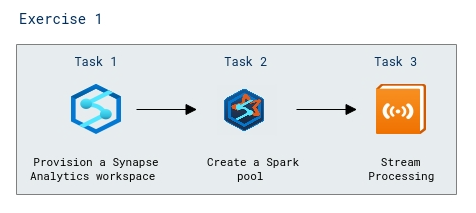

# Lab Scenario Preview: Lab 05a: Explore Spark Streaming in Azure Synapse Analytics

## Lab overview

In this lab, you'll use Spark Structured Streaming and delta tables in Azure Synapse Analytics to process streaming data.

## Objectives

After you complete this lab, you will be able to:

- Create a Synapse Analytics workspace
- Create a Spark pool
- Explore stream processing
    
## Architecture Diagram

  

Once you understand the lab's content, you can start the Hands-on Lab by clicking the **Launch** button located in the top right corner. This will lead you to the lab environment and guide. You can also preview the full lab guide [here](https://experience.cloudlabs.ai/#/labguidepreview/044489cf-1270-4df4-b30c-864fc209253d) if you want to go through detailed guide prior to launching lab environment.
