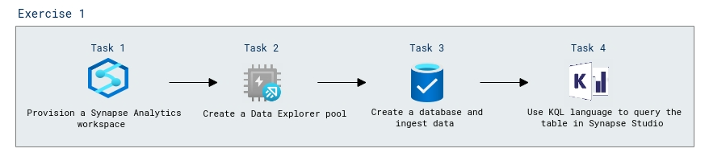

# Lab Scenario Preview: Module 05B: Explore Azure Synapse Data Explorer

## Lab overview

In this lab, you'll use Azure Synapse Data Explorer to analyze time-series data.

## Objectives

After you complete this lab, you will be able to:

- Create a Synapse Analytics workspace
- Create a Data Explorer pool
- Create a database and ingest data
- Use Kusto query language to query the table in Synapse Studio
    
## Architecture Diagram

Now that you know what the lab is going to be all about, you can launch next item **Hands-on Lab** which includes lab environment and lab guide. You can also preview the full lab guide [here](https://experience.cloudlabs.ai/#/labguidepreview/94f0dc0a-07ce-42c0-9858-9b57769aa70f) if you want to go through detailed guide prior to launching lab environment.

