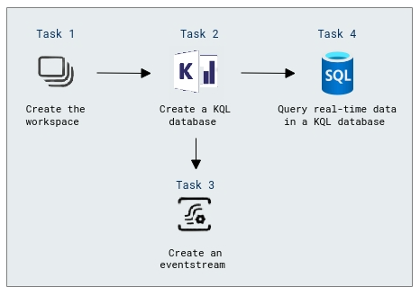

# Lab Scenario Preview: Lab 05c: Explore real-time analytics in Microsoft Fabric

## Lab overview

In this lab, you'll explore real-time analytics in Microsoft Fabric.

## Objectives

After you complete this lab, you will be able to:

+ Create the workspace
+ Create a KQL database
+ Create an eventstream
+ Query real-time data in a KQL database
  
## Architecture Diagram
 
   
 
Once you understand the lab's content, you can start the Hands-on Lab by clicking the **Launch** button located in the top right corner. 
This will lead you to the lab environment and guide. You can also preview the full lab guide [here](https://experience.cloudlabs.ai/#/labguidepreview/78b36126-ddf6-4020-aac7-c55bea7a3c1e) if you want to go through detailed guide prior to launching lab environment.
