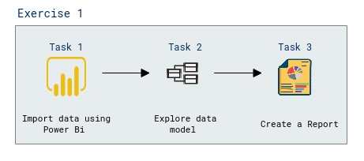

# Lab Scenario Preview: Module 06: Visualize data with Power BI

## Lab overview

In this lab, you'll use use Microsoft Power BI Desktop to create a data model and a report containing interactive data visualizations.

## Objectives

After you complete this lab, you will be able to:

- Import data using Power Bi.
- Explore a data model
- Create a report

## Architecture Diagram

Once you understand the lab's content, you can start the Hands-on Lab by clicking the **Launch** button located in the top right corner. This will lead you to the lab environment and guide. You can also preview the full lab guide [here](https://experience.cloudlabs.ai/#/labguidepreview/bf5aff03-d567-4752-ab04-33c0a4bfbc26) if you want to go through detailed guide prior to launching lab environment.
