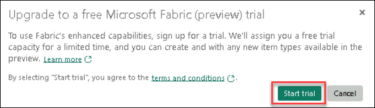
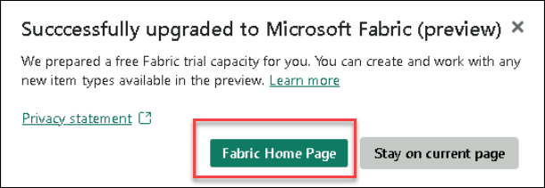

# Getting Started with Your DP-900: Microsoft Azure Data Fundamentals Workshop
 
Welcome to your DP-900: Microsoft Azure Data Fundamentals workshop! We've prepared a seamless environment for you to explore and learn about core data concepts and related Microsoft Azure data services. Let's begin by making the most of this experience:
 
## Accessing Your Lab Environment
 
Once you're ready to dive in, your virtual machine and lab guide will be right at your fingertips within your web browser.
 

### Virtual Machine & Lab Guide
 
Your virtual machine is your workhorse throughout the workshop. The lab guide is your roadmap to success.
 
## Exploring Your Lab Resources
 
To get a better understanding of your lab resources and credentials, navigate to the **Environment Details** tab.
 

 
## Utilizing the Split Window Feature
 
For convenience, you can open the lab guide in a separate window by selecting the **Split Window** button from the Top right corner.
 

 
## Managing Your Virtual Machine
 
Feel free to start, stop, or restart your virtual machine as needed from the **Resources** tab. Your experience is in your hands!
 

 
## Let's Get Started with Azure Portal
 
1. On your virtual machine, click on the Azure Portal icon as shown below:
 
.png)

 
2. You'll see the **Sign into Microsoft Azure** tab. Here, enter your credentials:
 
   - **Email/Username:** <inject key="AzureAdUserEmail"></inject>
 

 
3. Next, provide your password:
 
   - **Password:** <inject key="AzureAdUserPassword"></inject>
 

 
4. If prompted to stay signed in, you can click "No."
 
5. If a **Welcome to Microsoft Azure** pop-up window appears, simply click "Maybe Later" to skip the tour.
 
6. Click "Next" from the bottom right corner to embark on your Lab journey!
 
.png)

## Sign up for Microsoft Fabric free trial
 
1. Open an Edge browser, sign into [Microsoft Fabric](https://app.fabric.microsoft.com).

2. Enter the email <inject key="AzureAdUserEmail"></inject> in the **Email** section, and select **Submit**.

3. On the **You've selected Microsoft Fabric free** page, select **Sign-In**. Enter the Password: <inject key="AzureAdUserPassword"></inject>

   
   >**Note:** If you see the pop-up **Action Required**, select **Ask later**..
   > If you see the pop-up **Stay Signed in?**, click Yes

4.  In **Business phone number** provide any number (rest keep everything as default), and select **Get Started**.

5. On the **Power BI** home page, select the **Account manager for ODL_User <inject key="DeploymentID" enableCopy="false"/>**, select **Start trial** option.

6. If prompted, agree to the terms and then select **Start trial**.

7. Now it will given you an option, to select **Fabric home page** or you want to be on the **Current page**, select **Fabric home page**.
   

Now you're all set to explore the powerful world of technology. Feel free to reach out if you have any questions along the way. Enjoy your workshop!
