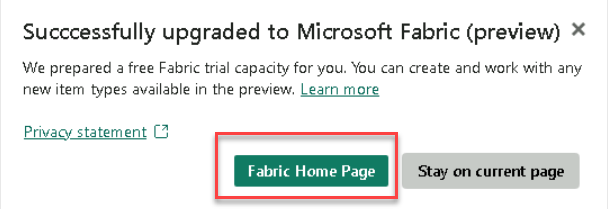

## Instructions

### Getting Started with Lab

1. Once the environment is provisioned, a virtual machine (JumpVM) on the left and lab guide on the right will get loaded in your browser. Use this virtual machine throughout the workshop to perform the lab.

    .png)

1. To get the lab environment details, you can select the **Lab Environment** tab, you can locate the **Lab Environment** tab on the upper right corner. Additionally, the credentials will also be emailed to your email address provided during registration.

    .png)

1. Use **Next** button from lower right corner to move on to the next page.

   

1. Open an Edge browser, sign into [Microsoft Fabric](https://app.fabric.microsoft.com).

1. Enter the email <inject key="AzureAdUserEmail"></inject> in the **Email** section, and select **Submit**.

    

1. On the **You've selected Microsoft Fabric free** page, select **Sign-In**. Enter the Password: <inject key="AzureAdUserPassword"></inject>

   
   
    >**Note:** If you see the pop-up **Action Required**, select **Ask later**..
   > If you see the pop-up **Stay Signed in?**, click Yes

1.  In **Business phone number** provide any number (rest keep everything as default), and select **Get Started**.

1. On the **Power BI** home page, select the **Account manager for ODL_User <inject key="DeploymentID" enableCopy="false"/>**, select **Start trial** option.

   

   

1. If prompted, agree to the terms and then select **Start trial**.

     

1. Now it will given you an option, to select **Fabric home page** or you want to be on the **Current page**, select **Fabric home page**.
   
     

