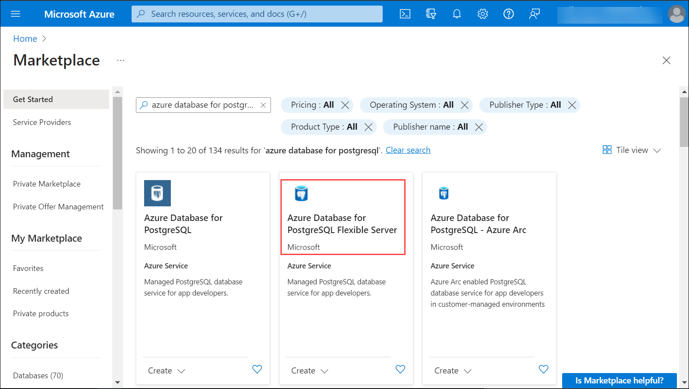

# Explore Azure Database for PostgreSQL

In this exercise you'll provision an Azure Database for PostgreSQL resource in your Azure subscription.

## Provision an Azure Database for PostgreSQL resource

In this exercise, you'll provision an Azure Database for PostgreSQL resource.

1. In the Azure portal, select **&#65291; Create a resource** from the upper left-hand corner and search for **Azure Database for PostgreSQL**.  From the marketplace select the **Azure Database for PostgreSQL Flexible Serve**
 
    

1. Review the Azure Database for PostgreSQL options that are available, and then in the **Azure Database for PostgreSQL** tile, select **Flexible server (Recommended)**, then **Create**.

    

1. Enter the following values on the **Create SQL Database** page:
    - **Subscription**: Select your Azure subscription.
    - **Resource group**: Choose the existing resource group **dp-900-lab01a-<inject key="DeploymentID" enableCopy="false"/>
    - **Server name**: Enter a unique name.
    - **Region**: Select a region near you.
    - **PostgreSQL version**: Leave unchanged.
    - **Workload type**: Select **Development**.
    - **Compute + storage**: Leave unchanged.
    - **Availability zone**: Leave unchanged.
    - **Enable high availability**: Leave unchanged.
    - **Admin username**: Your name.
    - **Password** and **Confirm password**: A suitably complex password.

1. Select **Next: Networking**.

1. Under **Firewall rules**, select **&#65291; Add current client IP address**.

1. Select **Review + Create**, and then select **Create** to create your Azure PostgreSQL database.

1. Wait for deployment to complete. Then go to the resource that was deployed, which should look like this:

    .png)

1. Review the options for managing your Azure Database for PostgreSQL resource.
 
Congratulations on completing the task! Now, it's time to validate it. Here are the steps:

 1. Click the (...) icon located at the upper right corner of the lab guide section and navigate to the Lab Validation Page.
 
 2. Hit the Validate button for the corresponding task.
 
 3. If you receive a success message, you can proceed to the next task. If not, carefully read the error message and retry the step, following the instructions in the lab guide.
 
 4. If you need any assistance, please contact us at labs-support@spektrasystems.com. We are available 24/7 to help you out.
