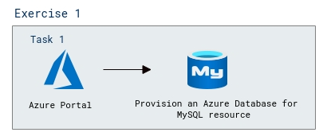
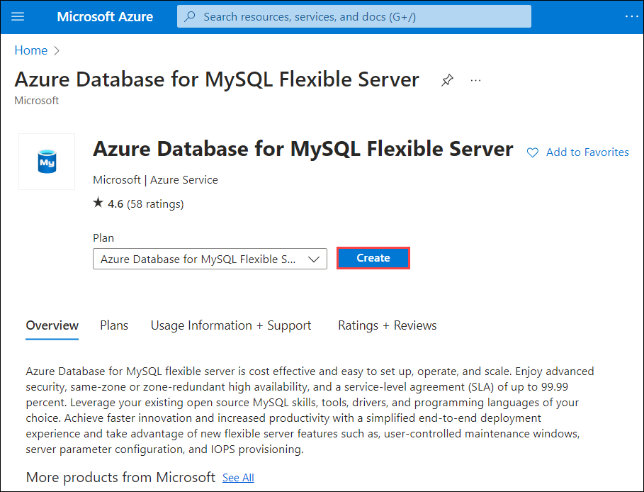
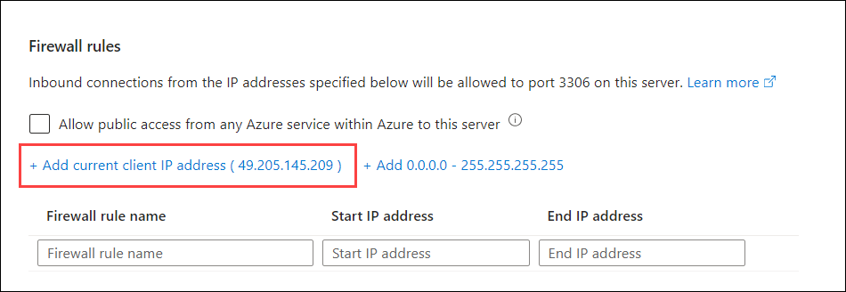
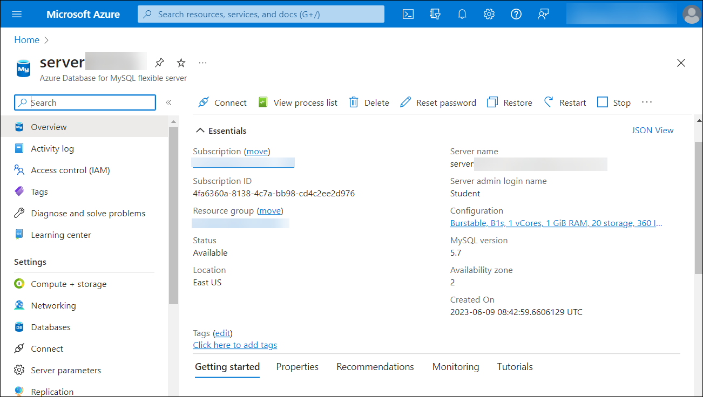

# Lab 01b: Explore Azure Database for MySQL

## Lab scenario
In this lab, you'll provision an Azure Database for MySQL resource in your Azure subscription.

## Lab objective

In this lab, you will perform:

+ Task 1: Provision an Azure Database for MySQL resource
  
## Estimated timing: 15 minutes

## Architecture diagram

  

### Exercise 1: Provision an Azure Database for MySQL resource

In this exercise, you'll provision an Azure Database for MySQL resource.

1. If you are not logged in already, click on the **Azure portal** shortcut that is available on the desktop and log in with the Azure credentials as shown below:
  
   - Username: <inject key="Username" enableCopy="false" />
   - Password: <inject key="Password" enableCopy="false" />

1. In the Azure portal, select **&#65291; Create a resource** from the upper left-hand corner and search for **Azure Database for MySQL**. From the marketplace select the **Azure Database for MySQL Flexible Server**.
 
1. On the **Azure Database for MySQ Flexible Server** select **Create**.
    
    

1. Enter the following values on the **Create SQL Database** page:
    - **Subscription**: Select your Azure subscription.
    - **Resource group**: Choose the existing resource group **dp-900-lab01b-<inject key="DeploymentID" enableCopy="false"/>**.
    - **Server name**: **server<inject key="DeploymentID" enableCopy="false" />**.
    - **Region**: Any available location near you.
    - **MySQL Version**: Leave unchanged.
    - **Workload type**: For development or hobby projects.
    - **Compute + storage**: Leave unchanged.
    - **Availability zone**: Leave unchanged.
    - **Enable high availability**: Leave unchanged.
    - **Admin username**: **Student**
    - **Password** and **Confirm password**: **Password@1**

1. Select **Next: Networking**.

1. Under **Firewall rules**, select **&#65291; Add current client IP address**.

   

1. Select **Review + Create**, and then select **Create** to create your Azure MySQL database.

1. Wait for deployment to complete. Then go to the resource that was deployed, which should look like this:

   
    
   >**Note**: The deployment might take a minute or two.

1. Review the options for managing your Azure Database for MySQL resource.

    > **Congratulations** on completing the task! Now, it's time to validate it. Here are the steps:
    > - Click the Lab Validation tab located at the upper right corner of the lab guide section and navigate to the Lab Validation Page.
    > - Hit the Validate button for the corresponding task.
    > - If you receive a success message, you can proceed to the next task. If not, carefully read the error message and retry the step, following the instructions in the lab guide.
    > - If you need any assistance, please contact us at labs-support@spektrasystems.com. We are available 24/7 to help you out.

## Review
In this lab, you have completed:
- Provision an Azure Database for MySQL resource
  
## You have successfully completed this lab
