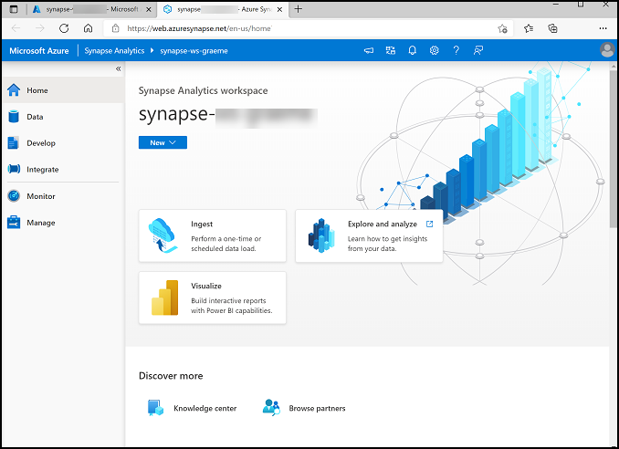
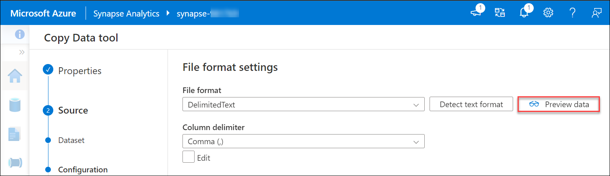
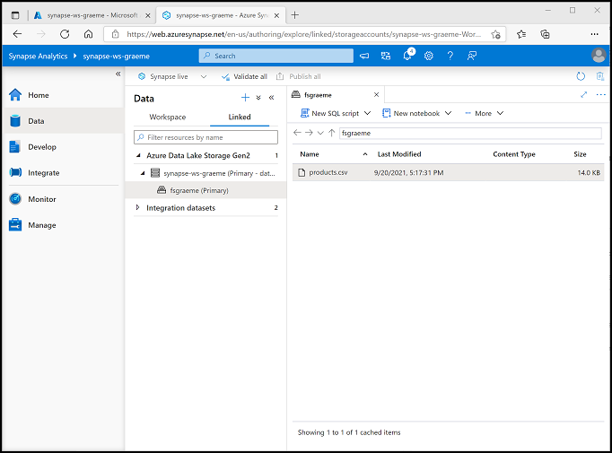
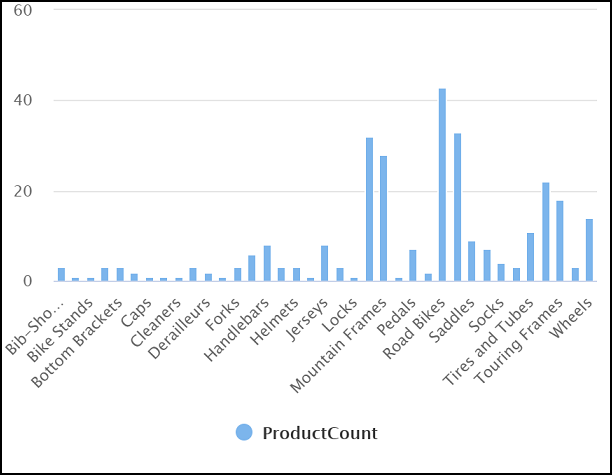
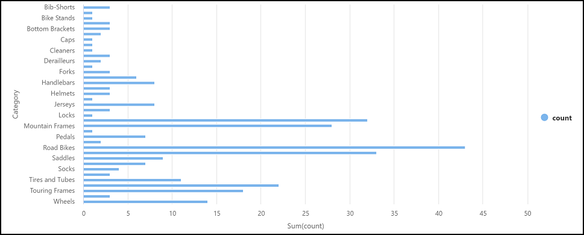

# Lab 04: Explore Azure Synapse Analytics

In this exercise, you'll use the already provisioned Azure Synapse Analytics workspace in your Azure subscription, to ingest and query data.

## Objectives

In this lab, you will complete the following tasks:

+ Task 1: Explore an Azure Synapse Analytics workspace
+ Task 2: Ingest data
+ Task 3: Use a SQL pool to analyze data
+ Task 4: Use a Spark pool to analyze data
  
## Estimated timing: 30 minutes

## Architecture diagram


## Exercise 1: Provision an Azure Synapse Analytics workspace

In this exercise, you'll use the Azure Synapse Analytics workspace to ingest and analyze some data.

The exercise is designed to familiarize you with some key elements of a modern data warehousing solution, not as a comprehensive guide to performing advanced data analysis with Azure Synapse Analytics. 

### Task 1: Explore an Azure Synapse Analytics workspace

1. In the Azure portal, on the **Home** page, use the **&#65291; Create a resource** icon to create a new resource.
2. Search for *Azure Synapse Analytics*, and create a new **Azure Synapse Analytics** resource with the following settings and click  **Create**.

     - **Subscription**: Select **Azure subscription**
        - **Resource group**: Select **DP-900-Module-4-<inject key="DeploymentID" enableCopy="false"/>**.
        - **Managed resource group**: Leave Blank
     - **Workspace name**: Enter **synapse-<inject key="DeploymentID" enableCopy="false"/>**.
     - **Region**: Select resource group region.
      - **Select Data Lake Storage Gen 2**: From subscription
        - **Account name**: Click on Create new then enter **datalake<inject key="DeploymentID" enableCopy="false"/>**.
        - **File system name**: Click on Create new then enter **fs<inject key="DeploymentID" enableCopy="false"/>**.

   > **Note**: A Synapse Analytics workspace requires two resource groups in your Azure subscription; one for resources you explicitly create, and another for managed resources used by the service. It also requires a Data Lake storage account in which to store data, scripts, and other artifacts.
    
1.  When you've entered these details, select **Review + create**, and then select **Create** to create the workspace.
2.   Wait for the workspace to be created - this may take five minutes or so.
6. When deployment is complete, go to the resource group that was created and notice that it contains your Synapse Analytics workspace and a Data Lake storage account.
7.  Select your Synapse workspace, and in its  **Overview**  page, in  **Open Synapse Studio**  card, select  **Open**  to open Synapse Studio in a new browser tab. Synapse Studio is a web-based interface that you can use to work with your Synapse Analytics workspace.
    
8.  On the left side of Synapse Studio, use the  **››**  icon to expand the menu - this reveals the different pages within Synapse Studio that you'll use to manage resources and perform data analytics tasks, as shown here:
    
    

    > **Congratulations** on completing the task! Now, it's time to validate it. Here are the steps:
    > - Click the Lab Validation tab located at the upper right corner of the lab guide section and navigate to the Lab Validation Page.
    > - Hit the Validate button for the corresponding task.
    > - If you receive a success message, you can proceed to the next task. If not, carefully read the error message and retry the step, following the instructions in the lab guide.
    > - If you need any assistance, please contact us at labs-support@spektrasystems.com. We are available 24/7 to help you out.

**You have successfully completed the lab.**  

### Task 2 : Ingest data

One of the key tasks you can perform with Azure Synapse Analytics is to define  _pipelines_  that transfer (and if necessary, transform) data from a wide range of sources into your workspace for analysis.

1.  In Synapse Studio, on the **Home** page, select **Ingest** to open the **Copy Data tool** tool.
    
2.  In the Copy Data tool, on the  **Properties**  step, ensure that  **Built-in copy task**  and  **Run once now**  are selected, and click  **Next >**.
    
3.  On the  **Source**  step, in the  **Dataset**  substep, select the following settings and click  **Create**.
    
    -   **Source type**: All
    -   **Connection**:  Create a new connection by selecting **+ New Connection**, and in the **New connection** pane that appears, on the **Generic protocol** tab, select **HTTP**. Then continue    
    -   create a connection to a data file using the following settings:
        -   **Name**: AdventureWorks Products
        -   **Description**: Product list via HTTP
        -   **Connect via integration runtime**: AutoResolveIntegrationRuntime
        -   **Base URL**:  `https://raw.githubusercontent.com/MicrosoftLearning/DP-900T00A-Azure-Data-Fundamentals/master/Azure-Synapse/products.csv`
        -   **Server Certificate Validation**: Enable
        -   **Authentication type**: Anonymous
4.  After creating the connection, on the  **Source/Dataset**  substep, ensure the following settings are selected, and then select  **Next >**:
    
    -   **Relative URL**:  _Leave blank_
    -   **Request method**: GET
    -   **Additional headers**:  _Leave blank_
    -   **Binary copy**:  Unselected
    -   **Request timeout**:  _Leave blank_
    -   **Max concurrent connections**:  _Leave blank_
5.  On the  **Source**  step, in the  **Configuration**  substep, select  **Preview data**  to see a preview of the product data your pipeline will ingest, then close the preview.

    
    
6.  After previewing the data, on the  **Source/Configuration**  step, ensure the following settings are selected, and then select  **Next >**:
    
    -   **File format**: DelimitedText
    -   **Column delimiter**: Comma (,)
    -   **Row delimiter**: Line feed (\n)
    -   **First row as header**: Selected
    -   **Compression type**: None
7.  On the  **Destination**  step, in the  **Dataset**  substep, select the following settings, and select **Create**:
    
    -   **Destination type**: Azure Data Lake Storage Gen 2 
    -   **Connection**:  _Create a new connection by selecting **+ New Connection** with the following properties:_
        -   **Name**: Products
        -   **Description**: Product list
        -   **Connect via integration runtime**: AutoResolveIntegrationRuntime
        -   **Authentication method**: Account key
        -   **Account selection method**: From azure subscription
            -   **Azure subscription**:  _select your subscription_
            -   **Storage account name**:  _Select your storage account_
        -   **Test connection**: To linked service
8.  After creating the connection, on the  **Destination/Dataset**  step, ensure the following settings are selected, and then select  **Next >**:
    
    -   **Folder path**:  Browse to your file system folder and select **fs<inject key="DeploymentID" enableCopy="false"/>**.
    -   **File name**: products.csv
    -   **Copy behavior**: None
    -   **Max concurrent connections**:  _Leave blank_
    -   **Block size (MB)**:  _Leave blank_
9.  On the  **Destination/Configuration**  step, ensure that the following properties are selected. Then select  **Next >**:
    
    -   **File format**: DelimitedText
    -   **Column delimiter**: Comma (,)
    -   **Row delimiter**: Line feed (\n)
    -   **Add header to file**: Selected
    -   **Compression type**: None
    -   **Max rows per file**:  _Leave blank_
    -   **File name prefix**:  _Leave blank_
10.  On the  **Settings**  step, enter the following settings and then click  **Next >**:

     -   **Task name**: Copy products
     -   **Task description**  Copy products data
     -   **Fault tolerance**:  _Leave blank_
     -   **Enable logging**:  Unselected
     -   **Enable staging**:  Unselected

11.  On the  **Review and finish**  step, on the  **Review**  substep, read the summary and then click  **Next >**.
    
12.  On the  **Deployment**  step, wait for the pipeline to be deployed and then click  **Finish**.
    
13.  In Synapse Studio, select the  **Monitor**  page, and in the  **Pipeline runs**  tab, wait for the  **Copy products**  pipeline to complete with a status of  **Succeeded**  (you can use the  **↻ Refresh**  button on the Pipeline runs page to refresh the status).
    
14.  On the  **Data**  page, select the  **Linked**  tab and expand the  **Azure Data Lake Storage Gen 2**  hierarchy until you see the file storage for your Synapse workspace. Then select the file storage to verify that a file named  **products.csv**  has been copied to this location, as shown here:
    
     
    

### Task 3 : Use a SQL pool to analyze data

Now that you've ingested some data into your workspace, you can use Synapse Analytics to query and analyze it. One of the most common ways to query data is to use SQL, and in Synapse Analytics you can use a  _SQL pool_  to run SQL code.

1.  In Synapse Studio, right-click the  **products.csv**  file in the file storage for your Synapse workspace, point to  **New SQL script**, and select  **Select TOP 100 rows**.
    
2.  In the  **SQL Script 1**  pane that opens, review the SQL code that has been generated, which should be similar to this:
    

    
    ```SQL
    -- This is auto-generated code
    SELECT
        TOP 100 *
    FROM
        OPENROWSET(
            BULK 'https://datalakexx.dfs.core.windows.net/fsxx/products.csv',
            FORMAT = 'CSV',
            PARSER_VERSION='2.0'
        ) AS [result]
    
    ```
    
    This code opens a rowset from the text file you imported and retrieves the first 100 rows of data.
    
3.  In the  **Connect to**  list, ensure  **Built-in**  is selected - this represents the built-in SQL Pool that was created with your workspace.
    
4.  On the toolbar, use the  **▷ Run**  button to run the SQL code, and review the results, which should look similar to this:
    
    .png)


5.  Note the results consist of four columns named C1, C2, C3, and C4; and that the first row in the results contains the names of the data fields. To fix this problem, add a HEADER_ROW = TRUE parameters to the OPENROWSET function as shown here (replacing  _datalakexx_  with **datalake<inject key="DeploymentID" enableCopy="false"/>** and  _fsxx_  with **fs<inject key="DeploymentID" enableCopy="false"/>** the names of your data lake storage account and file system), and then rerun the query:

    ```SQL
    SELECT
        TOP 100 *
    FROM
        OPENROWSET(
            BULK 'https://datalakexx.dfs.core.windows.net/fsxx/products.csv',
            FORMAT = 'CSV',
            PARSER_VERSION='2.0',
            HEADER_ROW = TRUE
        ) AS [result]
    ```

    Now the results look like this:

    .png)

    
    
6.  Modify the query as follows (replacing  _datalakexx_  with **datalake<inject key="DeploymentID" enableCopy="false"/>** and  _fsxx_  with **fs<inject key="DeploymentID" enableCopy="false"/>** the names of your data lake storage account and file system):
    

    ```SQL
    SELECT
        Category, COUNT(*) AS ProductCount
    FROM
        OPENROWSET(
            BULK 'https://datalakexx.dfs.core.windows.net/fsxx/products.csv',
            FORMAT = 'CSV',
            PARSER_VERSION='2.0',
            HEADER_ROW = TRUE
        ) AS [result]
    GROUP BY Category;
    ```

    
7.  Run the modified query, which should return a resultset that contains the number products in each category, like this:
    
    .png)
     
8.  In the  **Properties**  pane for  **SQL Script 1**, change the  **Name**  to  **Count Products by Category**. Then in the toolbar, select  **Publish**  to save the script.
    
9.  Close the  **Count Products by Category**  script pane.
    
10.  In Synapse Studio, select the  **Develop**  page, and notice that your published  **Count Products by Category**  SQL script has been saved there.
    
11.  Select the  **Count Products by Category**  SQL script to reopen it. Then ensure that the script is connected to the  **Built-in**  SQL pool and run it to retrieve the product counts.
    
12.  In the  **Results**  pane, select the  **Chart**  view, and then select the following settings for the chart:
    
     -   **Chart type**: Column
     -   **Category column**: Category
     -   **Legend (series) columns**: ProductCount
     -   **Legend position**: bottom - center
     -   **Legend (series) label**:  _Leave blank_
     -   **Legend (series) minimum value**:  _Leave blank_
     -   **Legend (series) maximum**:  _Leave blank_
     -   **Category label**:  _Leave blank_
    
     The resulting chart should resemble this:
    
     
    

### Task 4 : Use a Spark pool to analyze data

While SQL is a common language for querying structured datasets, many data analysts find languages like Python useful to explore and prepare data for analysis. In Azure Synapse Analytics, you can run Python (and other) code in a  _Spark pool_; which uses a distributed data processing engine based on Apache Spark.

1. In Synapse Studio, select the **Manage** page.
2. Select the **Apache Spark pools** tab, and then use the **&#65291; New** icon to create a new Spark pool with the following settings:
    - **Apache Spark pool name**: Enter **spark<inject key="DeploymentID" enableCopy="false"/>**.
    - **Node size family**: Memory Optimized
    - **Node size**: Small (4 vCores / 32 GB)
    - **Autoscale**: Enabled
    - **Number of nodes** 3----3
   
1. Review and create the Spark pool, and then wait for it to deploy (which may take a few minutes).
3. When the Spark pool has been deployed, in Synapse Studio, on the **Data** page, browse to the file system for your Synapse workspace. Then right-click **products.csv**, point to **New notebook**, and select **Load to DataFrame**.
4. In the **Notebook 1** pane that opens, in the **Attach to** list, select the **spark** Spark pool to created previously and ensure that the **Language** is set to **PySpark (Python)**.
6. Review the code in the first (and only) cell in the notebook, which should look like this:

    ```Python
    %%pyspark
    df = spark.read.load('abfss://fsxx@datalakexx.dfs.core.windows.net/products.csv', format='csv'
    ## If header exists uncomment line below
    ##, header=True
    )
    display(df.limit(10))
    
    ```

    
4.  Use the  **▷**  icon to the left of the code cell to run it, and wait for the results. The first time you run a cell in a notebook, the Spark pool is started - so it may take a minute or so to return any results.
    
    > **Note**: 
    If an error occurs because the Python Kernel isn't available yet, run the cell again.

5.  Eventually, the results should appear below the cell, and they should be similar to this:
    
    .png)
    
6.  Uncomment the  **header=True**  line (because the products.csv file has the column headers in the first line), so your code looks like this:
    
   
    ```Python
    %%pyspark
    df = spark.read.load('abfss://fsxx@datalakexx.dfs.core.windows.net/products.csv', format='csv'
    ## If header exists uncomment line below
    , header=True
    )
    display(df.limit(10))
    
    ```
    >**Note**: Modify the query as follows (replacing  _fsxx_ with **fs<inject key="DeploymentID" enableCopy="false"/>** and _datalakexx_ with **datalake<inject key="DeploymentID" enableCopy="false"/>** the names of your data lake storage account and file system):


7.  Rerun the cell and verify that the results look like this:
    
    .png)
    
    > Notice that running the cell again takes less time, because the Spark pool is already started.
    
8.  Under the results, use the  **＋ Code**  icon to add a new code cell to the notebook.
    
9.  In the new empty code cell, add the following code:

    ```Python
    df_counts = df.groupby(df.Category).count()
    display(df_counts)
    ```
    
10.  Run the new code cell by clicking its  **▷**  icon, and review the results, which should look similar to this:

       .png) 
     
11.  In the results output for the cell, select the  **Chart**  view. The resulting chart should resemble this:
    
     
    
12.  Close the  **Notebook 1**  pane and discard your changes.

     > **Congratulations** on completing the task! Now, it's time to validate it. Here are the steps:
     > - Click the Lab Validation tab located at the upper right corner of the lab guide section and navigate to the Lab Validation Page.
     > - Hit the Validate button for the corresponding task.If you receive a success message, you can proceed to the next task. 
     > - If not, carefully read the error message and retry the step, following the instructions in the lab guide.
     > - If you need any assistance, please contact us at labs-support@spektrasystems.com. We are available 24/7 to help you out.

### Review
In this lab, you have completed:
- Explore an Azure Synapse Analytics workspace
- Ingest data
- Use a SQL pool to analyze data
- Use a Spark pool to analyze data
  
## You have successfully completed this lab.


