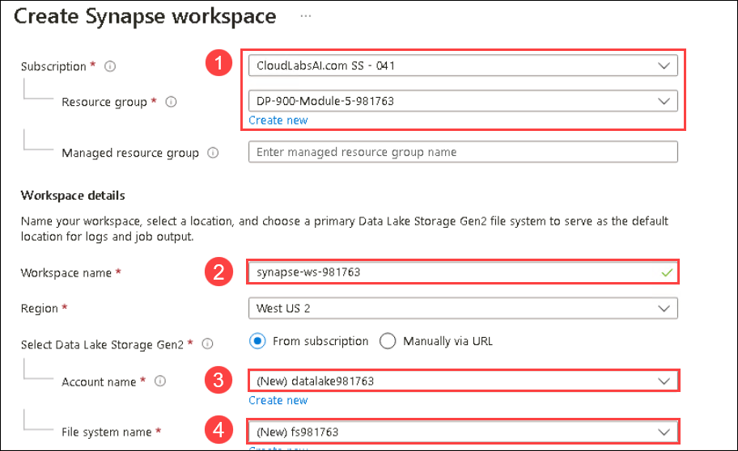
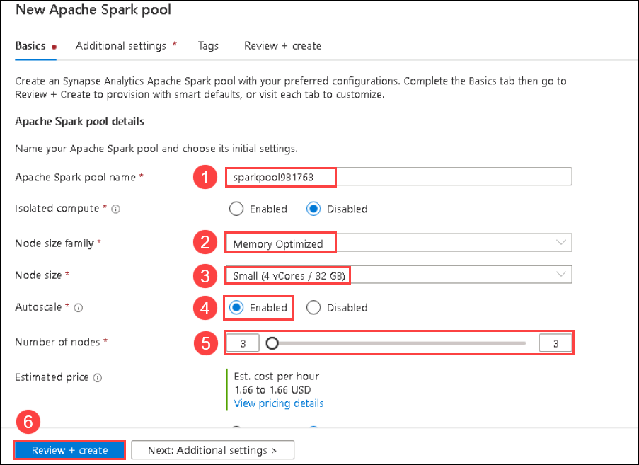

# Module 5(a): Explore Spark Streaming in Azure Synapse Analytics

In this exercise, you'll use *Spark Structured Streaming* and *delta tables* in Azure Synapse Analytics to process streaming data.

## Exercise

### Task 1: Provision a Synapse Analytics workspace

1. If you have not yet signed in, Open the Azure portal at [Azure portal](https://portal.azure.com?azure-portal=true), and sign in using the credentials associated with your Azure subscription.
    
    - Username: <inject key="Username" enableCopy="false" />
    - Password: <inject key="Password" enableCopy="false" /> 
    
2. In the Azure portal, on the **Home** page, use the **&#65291; Create a resource** icon to create a new resource.
3. Search for *Azure Synapse Analytics*, and create a new **Azure Synapse Analytics** resource with the following settings:
    - **Subscription**: *Your Azure subscription*
        - **Resource group**: *Select existing resource group, like "DP-900-Module-5-<inject key="DeploymentID" enableCopy="false"/>"*
    - **Workspace name**: *Enter a unique workspace name, for example "synapse-ws-<inject key="DeploymentID" enableCopy="false"/>"*.
    - **Region**: *Select any available location*.
    - **Select Data Lake Storage Gen 2**: From subscription
        - **Account name**: *Create a new account with a unique name, for example "datalake<inject key="DeploymentID" enableCopy="false"/>"*.
        - **File system name**: *Create a new file system with a unique name, for example "fs<inject key="DeploymentID" enableCopy="false"/>"*.
    
    
    
4. When you've entered these details, select **Review + create**, and then select **Create** to create the workspace.
5. Wait for the workspace to be created - this may take five minutes or so.
6. When deployment is complete, go to the resource group that was created and notice that it contains your Synapse Analytics workspace and a Data Lake storage account.
   
7.  Select your Synapse workspace, and in its  **Overview**  page, scroll down to the  **Open Synapse Studio**  card, select  **Open**  to open Synapse Studio in a new browser tab. Synapse Studio is a web-based interface that you can use to work with your Synapse Analytics workspace.
    
8.  On the left side of Synapse Studio, use the  **››**  icon to expand the menu - this reveals the different pages within Synapse Studio that you'll use to manage resources and perform data analytics tasks, as shown here:
    
    
    
 
 ### Task 2:Create a Spark pool

To use Spark to process streaming data, you need to add a Spark pool to your Azure Synapse workspace.

1. In Synapse Studio, select the **Manage** page.
2. Select the **Apache Spark pools** tab, and then use the **&#65291; New** icon to create a new Spark pool with the following settings:
    - **Apache Spark pool name**: "sparkpool<inject key="DeploymentID" enableCopy="false"/>"
    - **Node size family**: Memory Optimized
    - **Node size**: Small (4 vCores / 32 GB)
    - **Autoscale**: Enabled
    - **Number of nodes** 3----3
3. Review and create the Spark pool, and then wait for it to be deployed (which may take a few minutes).
   
   

### Task 3:Explore stream processing

To explore stream processing with Spark, you'll use a notebook that contains Python code and notes to help you perform some basic stream processing with Spark Structured Streaming and delta tables.

1. Download the [Structured Streaming and Delta Tables.ipynb](https://github.com/MicrosoftLearning/DP-900T00A-Azure-Data-Fundamentals/raw/master/streaming/Spark%20Structured%20Streaming%20and%20Delta%20Tables.ipynb) notebook to the lab (if the notebook is opened as a text file in your browser, save it to a local folder then open the downloaded file in **File Explorer** then click on **View** check the box of **File name extensions** then rename it as **Structured Streaming and Delta Tables.ipynb** if .txt extension is there remove it)
2. In Synapse Studio, select the **Develop** page.
3. On the **&#65291;** menu, select **&#8612; Import**, and select the **Structured Streaming and Delta Tables.ipynb** file on your local computer.
4. Follow the instructions in the notebook to attach it to your Spark pool and run the code cells it contains to explore various ways to use Spark for stream processing.

   > **Congratulations** on completing the task! Now, it's time to validate it. Here are the steps:
   > - Click the Lab Validation tab located at the upper right corner of the lab guide section and navigate to the Lab Validation Page.
   > - Hit the Validate button for the corresponding task.If you receive a success message, you can proceed to the next task. 
   > - If not, carefully read the error message and retry the step, following the instructions in the lab guide.
   > - If you need any assistance, please contact us at labs-support@spektrasystems.com. We are available 24/7 to help you out.

### You have successfully completed this lab.
