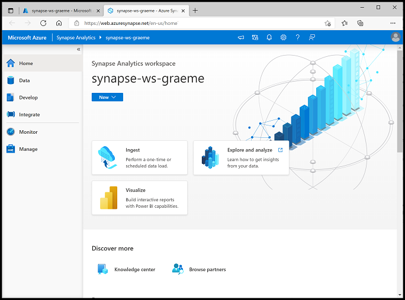

# Explore Spark Streaming in Azure Synapse Analytics

In this exercise, you'll use *Spark Structured Streaming* and *delta tables* in Azure Synapse Analytics to process streaming data.

## Provision a Synapse Analytics workspace
1.  Open the resource group **DP-900-Module-5**  that was precreated for you and notice that it contains your Synapse Analytics workspace, a Data Lake storage account and an Apache Spark pool.
    
2.  Select your Synapse workspace, and in its  **Overview**  page, in  **Open Synapse Studio**  card, select  **Open**  to open Synapse Studio in a new browser tab. Synapse Studio is a web-based interface that you can use to work with your Synapse Analytics workspace.
    
3.  On the left side of Synapse Studio, use the  **››**  icon to expand the menu - this reveals the different pages within Synapse Studio that you'll use to manage resources and perform data analytics tasks, as shown here:
    
    
4. Select your Synapse workspace, and in its **Overview** page, in **Open Synapse Studio** card, select **Open** to open Synapse Studio in a new browser tab. Synapse Studio is a web-based interface that you can use to work with your Synapse Analytics workspace.
5. On the left side of Synapse Studio, use the **&rsaquo;&rsaquo;** icon to expand the menu - this reveals the different pages within Synapse Studio that you will use to manage resources and perform data analytics tasks, as shown here:

    

## Explore stream processing

To explore stream processing with Spark, you'll use a notebook that contains Python code and notes to help you perform some basic stream processing with Spark Structured Streaming and delta tables.

1. Download the [Structured Streaming and Delta Tables.ipynb](https://github.com/MicrosoftLearning/DP-900T00A-Azure-Data-Fundamentals/raw/master/streaming/Spark%20Structured%20Streaming%20and%20Delta%20Tables.ipynb) notebook to your local computer (if the notebook is opened as a text file in your browser, save it to a local folder then open the downloaded file in **File Explorer** then click on **View** check the box of **File name extensions** then rename the file and remove .txt)
2. In Synapse Studio, select the **Develop** page.
3. On the **&#65291;** menu, select **&#8612; Import**, and select the **Structured Streaming and Delta Tables.ipynb** file on your local computer.
4. Follow the instructions in the notebook to attach it to your Spark pool and run the code cells it contains to explore various ways to use Spark for stream processing.

