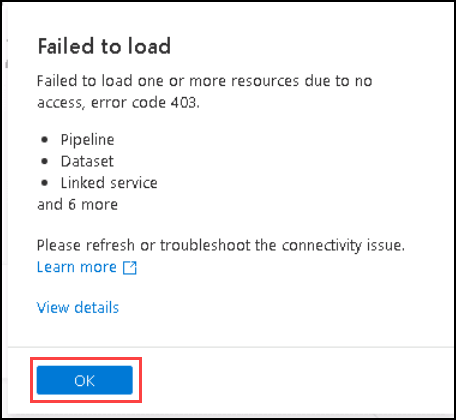
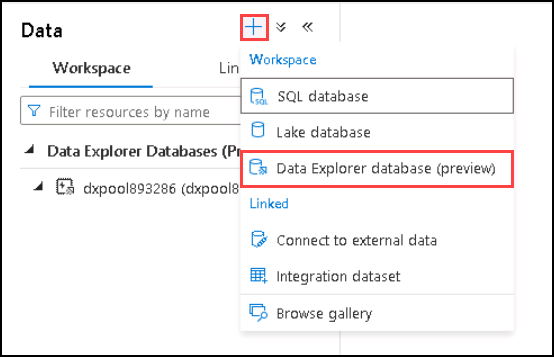
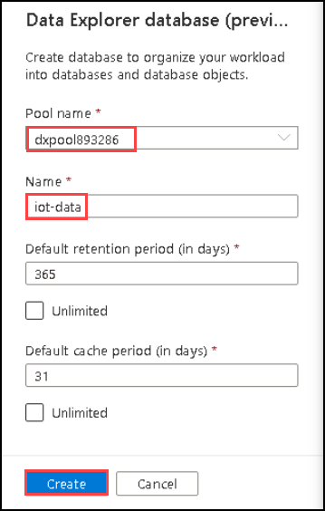
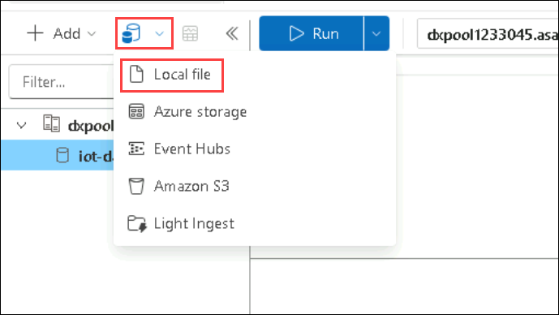
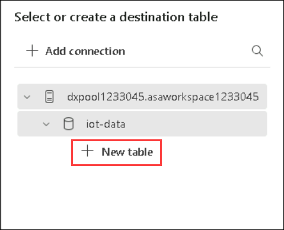
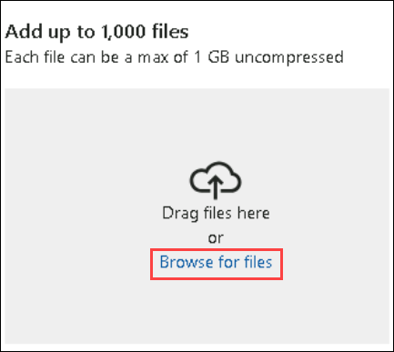

# Lab 05b: Explore Azure Synapse Data Explorer

## Lab scenario
In this lab, you'll use Azure Synapse Data Explorer to analyze time-series data.

## Lab objectives

In this lab, you will perform the following tasks:

+ Task 1: Create a Synapse Analytics workspace
+ Task 2: Create a Data Explorer pool
+ Task 3: Create a database and ingest data
+ Task 4: Use Kusto query language to query the table in Synapse Studio
  
## Estimated timing: 30 minutes

## Architecture diagram

.png)

## Exercise 1: Provision a Synapse Analytics workspace and Data Explorer pool

### Task 1: Create a Synapse Analytics workspace

1.  Open the resource group **DP-900-Module-5-<inject key="DeploymentID" enableCopy="false" />**  that was precreated for you from the Resource Group tab and notice that it contains your Synapse Analytics workspace, a Data Lake storage account and an Apache Spark pool.
    
2.  Select your Synapse workspace, and in its  **Overview**  page, in  **Open Synapse Studio**  card, select  **Open**  to open Synapse Studio in a new browser tab. Synapse Studio is a web-based interface that you can use to work with your Synapse Analytics workspace.
    
3. On the left side of Synapse Studio, use the  **››**  icon to expand the menu - this reveals the different pages within Synapse Studio that you'll use to manage resources and perform data analytics tasks, as shown here:
    
    
   
    >**Note:** Ignore if you receive any pop-up like **Failed to load** as shown below by clicking on **OK**.
       
      
    
### Task 2: Create a Data Explorer pool

1. In Synapse Studio, select the **Manage** page.
1. Select the **Data Explorer pools** tab, and then use the **&#65291; New** icon to create a new pool with the following settings:
    - **Data Explorer pool name**: dxpool<inject key="DeploymentID" enableCopy="false" />
    - **Workload**: Compute optimized
    - **Size**: Extra Small (2 cores)
1. Select **Next: Additional Settings >** and enable the **Streaming ingestion** setting - this enables Data Explorer to ingest new data from a streaming source, such as Azure Event Hubs.
1. Select **Review and create** to create the Data Explorer pool, and then wait for it to be deployed (which may take 15 minutes or longer - the status will change from *Creating* to *Online*).

### Task 3: Create a database and ingest data

1. In Synapse Studio, select the **Data** page.
1. Ensure that the **Workspace** tab is selected, and if necessary, select the **&#8635;** icon at the top-left of the page to refresh the view so that **Data Explorer databases** is listed.
1. Expand **Data Explorer databases** and verify that **dxpool<inject key="DeploymentID" enableCopy="false" />** is listed.
1. In the **Data** pane, use the **&#65291;** icon to create a new **Data Explorer database** in the **dxpool<inject key="DeploymentID" enableCopy="false" />** pool with the name **iot-data**.

    
    
    
    
    >**Note:** You will not be able to create the Data Explorer Database until the Data Explorer pool is created.
    
1. While waiting for the database to be created, download **devices.csv** from [https://github.com/MicrosoftLearning/DP-900T00A-Azure-Data-Fundamentals/raw/master/streaming/data/devices.csv](https://github.com/MicrosoftLearning/DP-900T00A-Azure-Data-Fundamentals/raw/master/streaming/data/devices.csv?azure-portal=true), saving it in any folder in the lab.
1. In Synapse Studio, wait for the database to be created if necessary, and then in the **...** menu for the new **iot-data** database, select **Open in Azure Data Explorer**.

1. Seclect the **Local File**, click on **New table** and type **devices**.
    
    
1. Click on **Browse the file** and here upload your downloded file **deviecs.csv**.
    
1. Now click on **Next**, **Finish** and then **Close**.

1. In Azure Data Explorer, on the **Query** tab, ensure that the **iot-data** database is selected and then in the query pane, enter the following query.

    ```kusto
    devices
    ```

1. On the toolbar, select **&#9655; Run** to run the query, and review the results, which should look similar to this:

    | Time | Device | Value |
    | --- | --- | --- |
    | 2022-01-01T00:00:00Z | Dev1 | 7 |
    | 2022-01-01T00:00:01Z | Dev2 | 4 |
    | ... | ... | ... |

    If your results match this, you have successfully created the **devices** table from the data in the file.

    > **Tip**: In this example, you imported a very small amount of batch data from a file, which is fine for the purposes of this exercise. In reality, you can use Data Explorer to analyze much larger volumes of data; and since you enabled stream ingestion, you could also have configured Data Explorer to ingest data into the table from a streaming source such as Azure Event Hubs.

### Task 4: Use Kusto query language to query the table in Synapse Studio

1. Close the Azure Data Explorer browser tab and return to the tab containing Synapse Studio.
1. On the **Data** page, expand the **iot-data** database and its **Tables** folder. Then in the **...** menu for the **devices** table, select **New KQL Script** > **Take 1000 rows**.
1. Review the generated query and its results. The query should contain the following code:

    ```kusto
    devices
    | take 1000
    ```

    The results of the query contain the first 1000 rows of data.

1. Modify the query as follows:

    ```kusto
    devices
    | where Device == 'Dev1'
    ```

1. Select **&#9655; Run** to run the query. Then review the results, which should contain only the rows for the *Dev1* device.

1. Modify the query as follows:

    ```kusto
    devices
    | where Device == 'Dev1'
    | where Time > datetime(2022-01-07)
    ```

1. Run the query and review the results, which should contain only the rows for the *Dev1* device later than January 7th 2022.

1. Modify the query as follows:

    ```kusto
    devices
    | where Time between (datetime(2022-01-01 00:00:00) .. datetime(2022-07-01 23:59:59))
    | summarize AvgVal = avg(Value) by Device
    | sort by Device asc
    ```

1. Run the query and review the results, which should contain the average device value recorded between January 1st and January 7th 2022 in ascending order of device name.

1. Close the KQL query tab, discarding your changes.

   > **Congratulations** on completing the task! Now, it's time to validate it. Here are the steps:
   > - Click the Lab Validation tab located at the upper right corner of the lab guide section and navigate to the Lab Validation Page.
   > - Hit the Validate button for the corresponding task.
   > - If you receive a success message, you can proceed to the next task. If not, carefully read the error message and retry the step, following the instructions in the lab guide
   > - If you need any assistance, please contact us at labs-support@spektrasystems.com. We are available 24/7 to help you out.

## Review
In this lab, you have completed:
- Create a Synapse Analytics workspace
- Create a Data Explorer pool
- Create a database and ingest data
- Use Kusto query language to query the table in Synapse Studio
  
## You have successfully completed this lab

